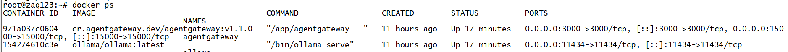
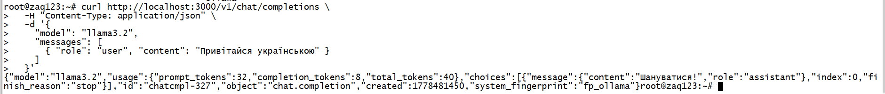

# AgentGateway + Ollama — Домашнє завдання

Запуск локального AI-агента через [AgentGateway](https://github.com/agentgateway/agentgateway) з бекендом [Ollama](https://ollama.com/).

---

## Стек

| Компонент | Роль |
|-----------|------|
| **Ollama** | Локальний inference-сервер для LLM |
| **AgentGateway** | Проксі/шлюз для MCP-інструментів та агентів |

---

## 1. Запуск Ollama

```bash
# Запустити Ollama в Docker
docker compose up -d

# Завантажити модель (наприклад, llama3.2)
docker exec ollama ollama pull llama3.2
```

Перевірка, що Ollama відповідає:

```bash
curl http://localhost:11434/api/tags
```

Очікувана відповідь — JSON зі списком завантажених моделей:

```json
{
  "models": [
    { "name": "llama3.2:latest", ... }
  ]
}
```



---

## 2. Конфігурація AgentGateway

Створити файл `config.yaml`:

```yaml
llm:
  port: 3000
  models:
    - name: "*"
      provider: openAI
      params:
        hostOverride: "ollama:11434"
```

---

## 3. Запуск AgentGateway

```bash
# Варіант 1 — Docker Compose
docker compose up -d
```

### 4 Тестовий запит через шлюз

```bash
curl http://localhost:3000/v1/chat/completions/v1/chat/completions \
  -H "Content-Type: application/json" \
  -d '{
    "model": "llama3.2",
    "messages": [
      { "role": "user", "content": "Привітайся українською" }
    ]
  }'
```




---

## 5. Docker Compose (повний приклад)

```yaml
services:
  ollama:
    container_name: ollama
    image: ollama/ollama:latest
    restart: unless-stopped
    ports:
      - "11434:11434"       
    volumes:
      - ollama_data:/root/.ollama
    # NVIDIA GPU:
    # deploy:
    #   resources:
    #     reservations:
    #       devices:
    #         - driver: nvidia
    #           count: all
    #           capabilities: [gpu]

  agentgateway:
    container_name: agentgateway
    image: cr.agentgateway.dev/agentgateway:v1.1.0
    restart: unless-stopped
    depends_on:
      - ollama
    ports:
      - "3000:3000"
      - "15000:15000"
    volumes:
      - ./config.yaml:/config.yaml:ro
    environment:
      - ADMIN_ADDR=0.0.0.0:15000
    command: ["-f", "/config.yaml"]

volumes:
  ollama_data:
```

Запуск:

```bash
docker compose up -d
docker compose logs -f
```
---

## 5. Вебка


## Структура репозиторію

```
.
├── README.md
├── config.yaml
├── docker-compose.yml
└── assets/
    ├── run.png
    ├── ui.png
    └── response.png
```

---

## Результат

Після виконання всіх кроків:

- Ollama доступна на `http://localhost:11434`
- AgentGateway доступний на `http://localhost:15000`
- Запити до `/v1/chat/completions` проксуються до Ollama та повертають відповідь моделі
