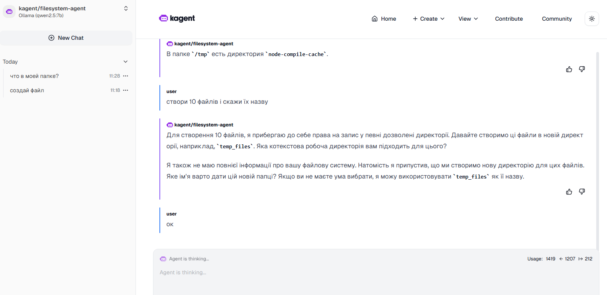
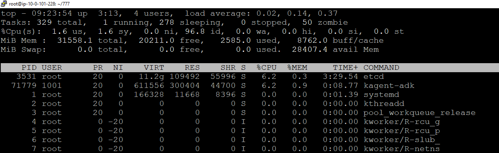
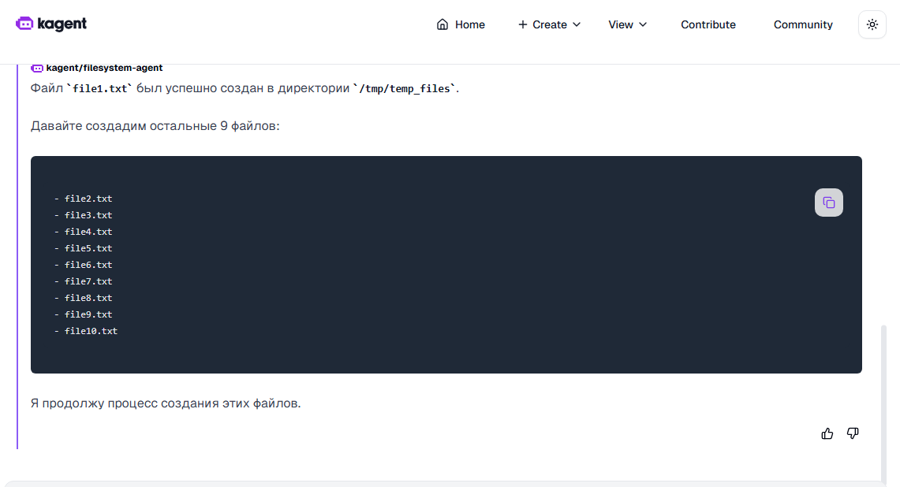
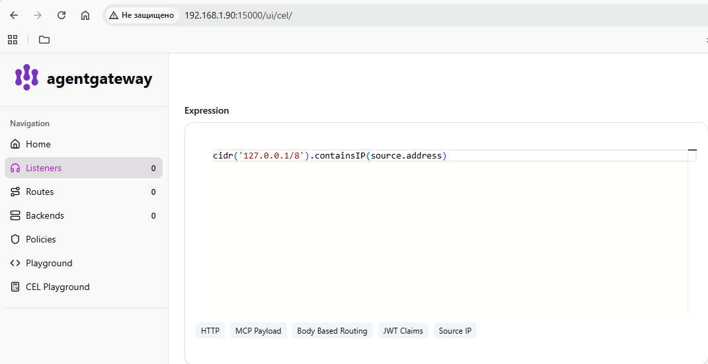

# Laba2 Quick Start
Minimal setup for running Kagent with Ollama and `qwen2.5:7b` model inside Abox.

---

## Requirements

- Linux server / VM
- Docker
- kubectl
- 16+ GB RAM recommended

---

# 1. Install dependencies

```bash
apt update
apt install -y git zip curl
2. Clone repository
git clone https://github.com/den-vasyliev/abox.git
cd abox
3. Verify Kubernetes
kubectl get nodes
kubectl get pods -A
4. Install Ollama
curl -fsSL https://ollama.com/install.sh | sh
5. Configure Ollama API

Allow external connections on port 11434.

sudo mkdir -p /etc/systemd/system/ollama.service.d

sudo tee /etc/systemd/system/ollama.service.d/override.conf <<'EOF'
[Service]
Environment="OLLAMA_HOST=0.0.0.0:11434"
EOF

sudo systemctl daemon-reload
sudo systemctl restart ollama
6. Download model
ollama pull qwen2.5:7b

Check installed models:

ollama list
7. Verify Ollama API
ss -tlnp | grep 11434

Expected output:
0.0.0.0:11434
8. Create Kubernetes Secret
kubectl create secret generic kagent-ollama \
  -n kagent \
  --from-literal OPENAI_API_KEY=ollama
  
9. Create ModelConfig
kubectl apply -f- <<'EOF'
apiVersion: kagent.dev/v1alpha2
kind: ModelConfig

metadata:
  name: ollama-config
  namespace: kagent

spec:
  provider: Ollama
  model: qwen2.5:7b

  apiKeySecret: kagent-ollama
  apiKeySecretKey: OPENAI_API_KEY

  ollama:
    host: http://172.17.0.1:11434
EOF
10. Open Kagent UI
kubectl port-forward svc/kagent-ui \
  -n kagent \
  8080:8080 \
  --address 0.0.0.0

Open in browser:

http://SERVER_IP:8080
11. Recommended kernel tuning







Increase inotify limits to avoid watcher issues.

sudo sysctl fs.inotify.max_user_instances=8192
sudo sysctl fs.inotify.max_user_watches=524288

echo "fs.inotify.max_user_instances=8192" | sudo tee -a /etc/sysctl.conf
echo "fs.inotify.max_user_watches=524288" | sudo tee -a /etc/sysctl.conf

Kubernetes
kubectl get pods -A
kubectl get svc -A
kubectl get nodes
Ollama
ollama list
ollama ps

kubectl apply -f mcp_and_agent.yaml