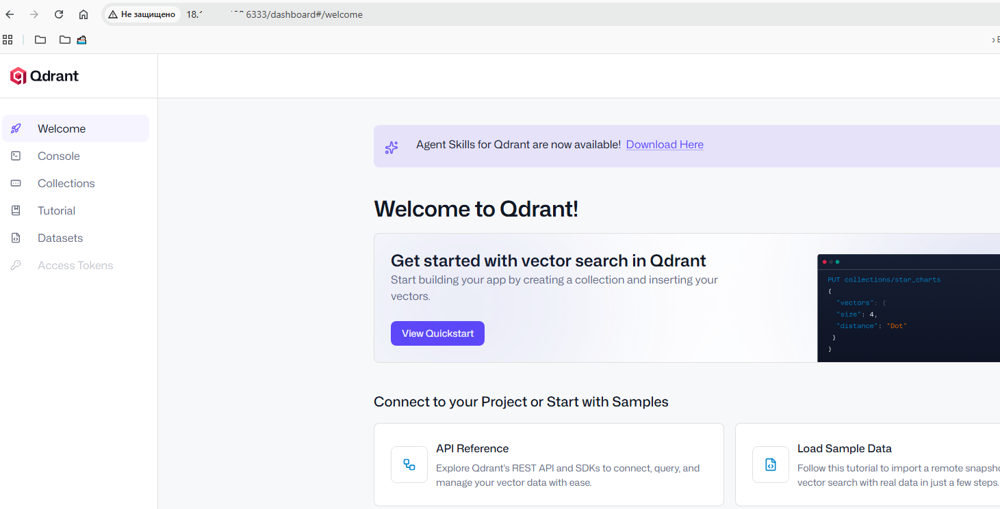
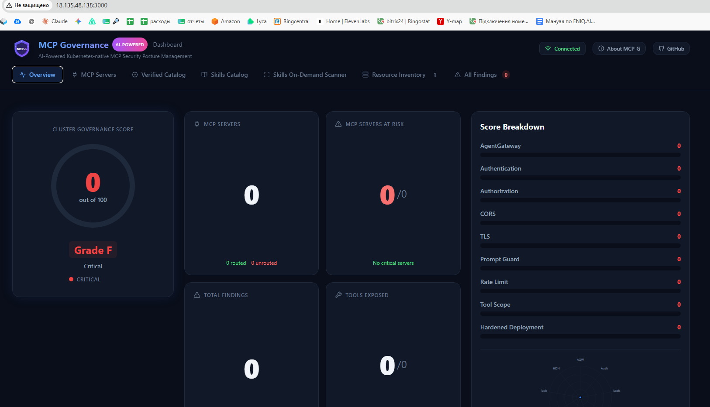
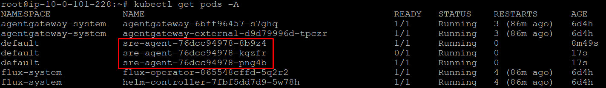
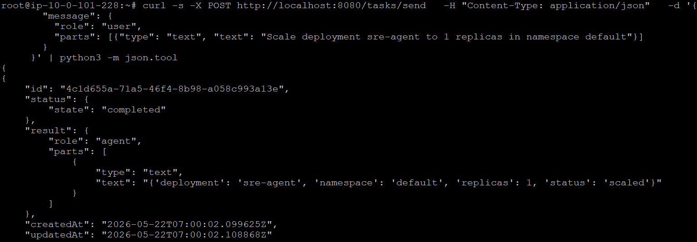
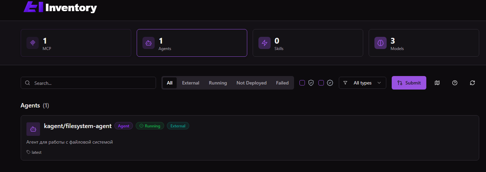
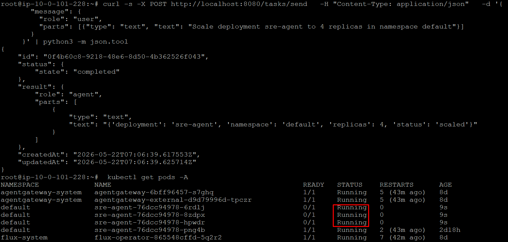

# Laba3 - SRE Kubernetes Agent with Observability

## Quick Start

### 1. Build and Deploy

```bash
# Build image
docker build -t sre-agent:1.0.0 .

# Apply K8s manifests
kubectl apply -f k8s/rbac.yaml
kubectl apply -f k8s/deployment.yaml
kubectl apply -f k8s/service.yaml
kubectl apply -f k8s/servicemonitor.yaml  # Для Prometheus
```

### 2. Test Agent

```bash
# Port forward
kubectl port-forward svc/sre-agent 8080:8080

# Check health
curl http://localhost:8080/health/ready

# Send task
curl -X POST http://localhost:8080/tasks/send \
  -H "Content-Type: application/json" \
  -d '{
    "message": {
      "role": "user",
      "parts": [{"type": "text", "text": "check pod health in namespace default"}]
    }
  }'

# View metrics
curl http://localhost:8080/metrics
```


# Laba3 Quick Start

---

# 1. Install dependencies

```bash
1. APT
apt update
apt install -y git zip curl


9. Create ModelConfig


kubectl apply -f mcp_and_agent.yaml

```

## Запуск qdrant.


## Робота mcpg.


## Запуск scale.


## Робота send_data.


## Запуск inv.


## Робота 31.



