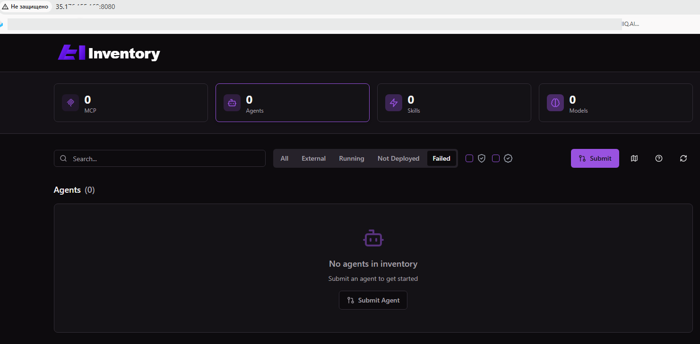

# LABA 3

Agent implementing Google A2A Protocol with Agent Card discovery via Well-Known URI.

## Overview

This agent provides Kubernetes cluster management capabilities through a conversational AI interface. It implements the [Google A2A Protocol](https://a2a.google) specification and exposes its capabilities via an Agent Card at the Well-Known URI endpoint.

## Features

- **A2A Protocol Compliance** - Full implementation of Google Agent-to-Agent protocol
- **Agent Card Discovery** - RFC 8615 Well-Known URI for agent capability discovery
- **Ollama LLM Backend** - Uses local Ollama instance on host machine
- **Kubernetes Tools** - kubectl operations, cluster analysis, pod diagnostics
- **OpenTelemetry Observability** - Distributed tracing with Jaeger
- **kagent.dev Integration** - CRD with `apiVersion: kagent.dev/v1alpha1`

## Prerequisites

**Ollama must be running on the host machine:**

```bash
# Install Ollama
curl -fsSL https://ollama.com/install.sh | sh

# Pull the llama3 model
ollama pull llama3

# Verify Ollama is running
curl http://localhost:11434/api/tags
```

## Quick Start

### 1. Build the Agent Image

```bash
cd agent
docker build -t sre-agent:latest .
```

### 2. Deploy to Kubernetes

```bash
# Deploy observability stack (Jaeger)
kubectl apply -f manifests/observability.yaml

# Deploy the agent
kubectl apply -f manifests/deployment.yaml

# Apply kagent CRD (if kagent operator is installed)
kubectl apply -f manifests/agent-crd.yaml
```

### 3. Verify Deployment

```bash
# Check pod status
kubectl get pods -n kagent-system

# Check agent logs
kubectl logs -n kagent-system -l app=sre-agent -f

# Port-forward to access the agent
kubectl port-forward -n kagent-system svc/sre-agent 8080:8080
```

## Agent Card Discovery

### Get Agent Card

```bash
# Via port-forward
kubectl port-forward -n kagent-system svc/sre-agent 8080:8080
curl http://localhost:8080/.well-known/agent-card.json | jq

# Or directly from cluster
kubectl run curl --image=curlimages/curl -i --rm --restart=Never -- \
  curl -s http://sre-agent.kagent-system.svc.cluster.local:8080/.well-known/agent-card.json
```

### Agent Card Structure

The Agent Card contains:

```json
{
  "$schema": "https://a2a.google/schemas/agent-card/v1",
  "name": "SRE Kubernetes Agent",
  "version": "1.0.0",
  "description": "AI-powered SRE agent for Kubernetes",
  "capabilities": {
    "streaming": true,
    "async": true,
    "observability": {
      "traces": true,
      "metrics": true,
      "logs": true
    }
  },
  "endpoints": {
    "agent": "http://sre-agent.kagent-system.svc.cluster.local:8080/v1/agent",
    "health": "http://sre-agent.kagent-system.svc.cluster.local:8080/health",
    "metrics": "http://sre-agent.kagent-system.svc.cluster.local:8080/metrics"
  },
  "tools": [
    {
      "name": "kubectl_get",
      "description": "Get Kubernetes resources",
      "parameters": {...}
    },
    ...
  ],
  "authentication": {
    "type": "bearer"
  }
}
```

## API Endpoints

### GET /.well-known/agent-card.json

Returns the Agent Card with full capability specification.

**Response:** `200 OK`
```json
{
  "$schema": "https://a2a.google/schemas/agent-card/v1",
  "name": "SRE Kubernetes Agent",
  ...
}
```

## Using the Agent

### Example 1: Analyze Cluster Health

```bash
curl -X POST http://localhost:8080/v1/agent \
  -H "Content-Type: application/json" \
  -d '{
    "messages": [
      {
        "role": "user",
        "content": "Analyze the cluster health"
      }
    ],
    "tools": ["analyze_cluster_health"],
    "stream": false
  }' | jq
```

### Example 2: Diagnose Pod Issues

```bash
curl -X POST http://localhost:8080/v1/agent \
  -H "Content-Type: application/json" \
  -d '{
    "messages": [
      {
        "role": "user",
        "content": "Why is my pod failing?"
      }
    ],
    "context": {
      "pod_name": "my-app-pod",
      "namespace": "default"
    }
  }' | jq
```

## Project Structure

```
LABA3/
├── README.md                      # This file
├── .well-known/
│   └── agent-card.json           # Agent Card for discovery
├── agent/
│   ├── Dockerfile                # Container image definition
│   ├── main.py                   # FastAPI agent implementation
│   ├── requirements.txt          # Python dependencies
│   └── .well-known/
│       └── agent-card.json       # Agent Card (copied into container)
└── manifests/
    ├── observability.yaml        # Jaeger deployment
    ├── deployment.yaml           # Agent deployment + ConfigMap + RBAC
    └── agent-crd.yaml           # kagent.dev/v1alpha1 CRD definition
```

---

# LABA 3.1 - AI Infrastructure Deployment

## Overview

This project demonstrates AI infrastructure deployment using Kubernetes, including:
- **Agent Registry Inventory** - Registry for AI agents and resources
- **MCPG** (MCP Security Governance) - Security and management system for MCP
- **Qdrant** - Vector database for AI applications

## Components

### 1. Agent Registry Inventory

**Purpose**: Centralized registry for discovering and managing AI agents in the cluster.

**Functionality**:
- Automatic AI agent discovery via Agent Card Protocol
- REST API for registry queries
- Kubernetes integration through CRD (Custom Resource Definitions)
- Agent health monitoring

**Deployment**:
```bash
# Clone repository
git clone https://github.com/den-vasyliev/agentregistry-inventory
cd agentregistry-inventory

# Apply manifests
kubectl apply -f manifests/

# Check status
kubectl get pods -n agent-registry
kubectl get svc -n agent-registry
```

**API Access**:
```bash
# Port-forward for local access
kubectl port-forward -n agent-registry svc/inventory 8080:8080

# Get list of agents
curl http://localhost:8080/api/v1/agents

# Search agents by capabilities
curl http://localhost:8080/api/v1/agents?capability=text-generation
```

**Agent Card Example**:


### 2. MCPG (MCP Security Governance)

**Purpose**: Security and management system for Model Context Protocol (MCP).

**Functionality**:
- Access control for MCP servers
- Tool invocation auditing
- Policy enforcement for AI operations
- Rate limiting and quotas
- Security logging and monitoring

**Deployment**:
```bash
# Clone repository
git clone https://github.com/techwithhuz/mcp-security-governance
cd mcp-security-governance

# Create namespace
kubectl create namespace mcpg

# Apply configuration
kubectl apply -f k8s/

# Check deployment
kubectl get all -n mcpg
```

**Check deployment**:
```bash
kubectl get all -n mcpg

# Security metrics
kubectl port-forward -n mcpg svc/mcpg-metrics 9090:9090
# Open http://localhost:9090/metrics
```


### 3. Qdrant Vector Database

**Purpose**: High-performance vector database for storing embeddings and semantic search.

**Functionality**:
- Storage of vector representations (embeddings)
- Fast semantic search (ANN - Approximate Nearest Neighbor)
- Metadata filtering
- Horizontal scaling
- Persistent storage

**Deployment via Helm**:
```bash
# Add Helm repository
helm repo add qdrant https://qdrant.github.io/qdrant-helm
helm repo update

# Create namespace
kubectl create namespace qdrant

# Install with basic configuration
helm install qdrant qdrant/qdrant \
  --namespace qdrant \
  --set replicaCount=3 \
  --set persistence.enabled=true \
  --set persistence.size=10Gi \
  --set resources.requests.memory=2Gi \
  --set resources.requests.cpu=1000m

# Check status
kubectl get pods -n qdrant
kubectl get pvc -n qdrant
```

**API Usage**:
```bash
# Port-forward for access
kubectl port-forward -n qdrant svc/qdrant 6333:6333

# Create collection
curl -X PUT http://localhost:6333/collections/my_collection \
  -H 'Content-Type: application/json' \
  -d '{
    "vectors": {
      "size": 384,
      "distance": "Cosine"
    }
  }'

# Add vectors
curl -X PUT http://localhost:6333/collections/my_collection/points \
  -H 'Content-Type: application/json' \
  -d '{
    "points": [
      {
        "id": 1,
        "vector": [0.1, 0.2, 0.3, ...],
        "payload": {"text": "Example document"}
      }
    ]
  }'

# Search for similar vectors
curl -X POST http://localhost:6333/collections/my_collection/points/search \
  -H 'Content-Type: application/json' \
  -d '{
    "vector": [0.1, 0.2, 0.3, ...],
    "limit": 10
  }'
```


## Screenshots

### Agent Registry Inventory


### MCPG Security Governance


### Qdrant Vector Database


### Deployment and Scaling


### Data Operations

